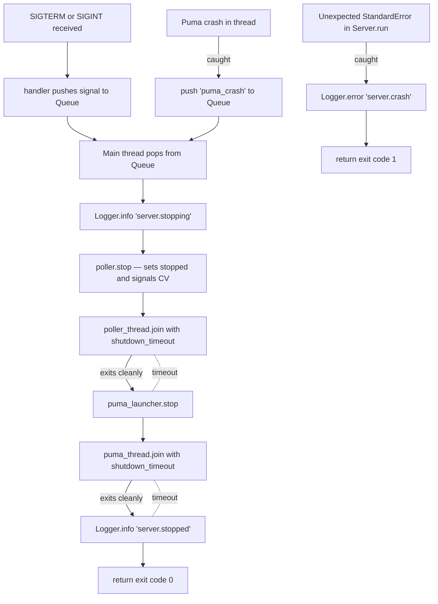
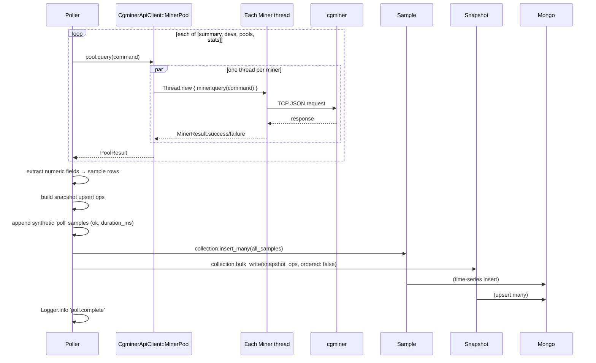
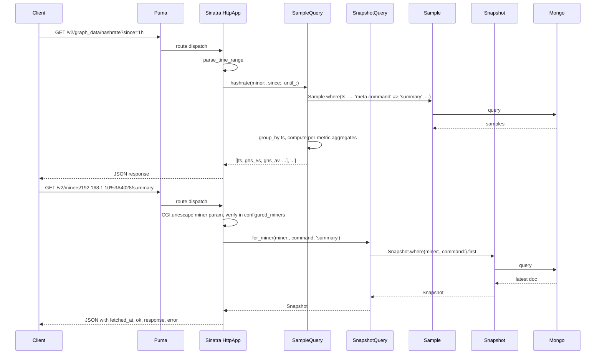

# Architecture

## Design goals

1. **One process, foreground, supervisor-driven.** No PID files, no `daemonize`, no `start`/`stop`/`restart` subcommands. The CLI has `run` only; `systemd`/`docker`/`launchd` own the lifecycle. This was a deliberate simplification in the 1.0 rewrite.
2. **Two concurrent threads, one exit path.** A polling thread and an HTTP server thread. Both feed failures into a shared `Queue` that unblocks the main thread to drive graceful shutdown. No watchdog, no restart logic — if either thread can't keep going, the process exits and the supervisor restarts.
3. **Write-path and read-path are fully decoupled via Mongo.** The Poller writes samples + snapshots. The HTTP server reads them. Neither holds a live reference to the other's data structures beyond a few Sinatra settings (`settings.poller` is read for metrics counters, not for call-through).
4. **Structural separation between "current state" and "time series".** Two MongoDB collections, two Mongoid models, two query modules. See `data_models.md`.
5. **Config is immutable at boot.** `Data.define` Config, validated once in `from_env`, never mutated. Changing anything requires a restart. Justified by the operational model (supervisor-driven, cheap to restart).
6. **Library code logs structurally, never to stderr directly.** One logger module; everything else calls it. See `components.md` for the logger contract.

## The two-thread model

```mermaid
sequenceDiagram
    participant Main as Main thread
    participant Queue as @stop: Queue
    participant Poller as Poller thread
    participant Puma as Puma thread
    participant Miners as cgminer instances
    participant Mongo as MongoDB

    Main->>Main: install_signal_handlers (SIGTERM/SIGINT → @stop)
    Main->>Main: Mongoid.configure, bootstrap collections
    Main->>Poller: Thread.new { poller.run_until_stopped }
    Main->>Puma: Thread.new { puma_launcher.run }
    Main->>Main: reinstall_signal_handlers (after Puma's setup_signals)
    Main->>Queue: @stop.pop (blocks)

    loop every CGMINER_MONITOR_INTERVAL
        Poller->>Miners: MinerPool.query(summary/devs/pools/stats)
        Miners-->>Poller: responses (per-miner PoolResult)
        Poller->>Mongo: insert_many samples + bulk_write snapshots
    end

    Puma->>Puma: serve /v2/* requests
    Note over Puma: concurrent; isolated from Poller

    Note over Main: SIGTERM arrives
    Main->>Queue: signal pushed
    Queue-->>Main: pop returns signal
    Main->>Poller: poller.stop (signals @cv, sets @stopped=true)
    Poller-->>Main: thread exits via loop condition
    Main->>Main: poller_thread.join(shutdown_timeout)
    Main->>Puma: puma_launcher.stop
    Puma-->>Main: thread exits
    Main->>Main: puma_thread.join(shutdown_timeout)
    Main->>Main: exit 0
```

## Why signal handling is fiddly

The file to look at is `lib/cgminer_monitor/server.rb`. Three subtleties:

1. **`install_signal_handlers` must run before `Puma::Launcher.run`.** Puma's `setup_signals` synchronously overwrites process-wide signal handlers. If we install ours later, Puma silently takes our SIGTERM/SIGINT.

2. **`raise_exception_on_sigterm false`.** By default, Puma raises `SignalException` on SIGTERM, which would bubble out of the Puma thread. We own shutdown, not Puma, so we disable that.

3. **`reinstall_signal_handlers` runs after launcher start.** Even with `raise_exception_on_sigterm false`, Puma installs other handlers (USR1, USR2, HUP) that can stomp on what we want. We `sleep 0.05` to let Puma's thread finish `setup_signals`, then re-install the two we care about. It's a brief handoff race; the sleep is a heuristic compromise, not a correctness guarantee.

**Consequence:** If anyone changes how the Server starts or stops Puma, they need to re-check that SIGTERM still reliably routes through our `@stop` queue rather than raising in Puma.

## Graceful shutdown, concretely



The shutdown path is bounded: if the poller takes longer than `CGMINER_MONITOR_SHUTDOWN_TIMEOUT` (default 10s) to clean up, we move on. Worst case, a mid-flight `insert_many` gets killed by the supervisor.

## The Poller's interruptible sleep

`Poller#run_until_stopped` runs an iteration, measures how long it took, then sleeps the remainder of the interval. The sleep uses a `ConditionVariable`:

```ruby
def interruptible_sleep(seconds)
  @mutex.synchronize do
    @cv.wait(@mutex, seconds) unless @stopped
  end
end
```

`Poller#stop` synchronizes on the same mutex, sets `@stopped = true`, and `@cv.signal`s. The sleeping thread wakes immediately instead of waiting out the rest of the interval. Without this, a shutdown during a long poll cycle could stall for up to a full interval.

## Request lifecycle (write path)



**Key observations:**
- `extract_samples` normalizes keys (`"GHS 5s"` → `ghs_5s`, `"Pool Rejected%"` → `pool_rejected_pct`) and only keeps numeric values. String fields (device status, pool URL) are dropped from the samples collection but preserved in full in `latest_snapshot`.
- Each miner also emits two synthetic per-poll samples: `{command: 'poll', metric: 'ok', v: 0|1}` and `{command: 'poll', metric: 'duration_ms', v: ...}`. These drive the availability graph and the Prometheus `cgminer_available` gauge.
- `bulk_write(..., ordered: false)` means snapshot upserts don't short-circuit on the first failure — each miner's snapshot has an independent chance to succeed.
- Errors at Mongo level are logged and counted; they don't re-raise out of `poll_once`. So a transient Mongo outage degrades polling silently (stats recorded in `polls_failed`) rather than crashing the process.

## Request lifecycle (read path)



**Key observations:**
- The read path never hits cgminer directly. Everything it returns was written by the Poller at the last poll interval.
- `settings.configured_miners` is eager-built by `Server#run` from `Config.current.miners_file` via `HttpApp.parse_miners_file`. Frozen. Specs populate it via `HttpApp.configure_for_test!(miners: …)`.
- Time-range parameters accept ISO-8601 or relative (`1h`, `30m`, `7d`, `2w`). Defaults to the last hour.
- `Cache-Control: public, max-age=<interval>` is set on graph data responses so intermediate caches don't hammer Mongo.
- `miner_snapshot` validates that the `:miner` path param exists in `settings.configured_miners` and returns 404 if not — an unknown miner ID can't even check the db.

## HTTP API surface summary

All under `/v2/*`. See `interfaces.md` for the full contract.

- **`/healthz`** — returns one of `starting` / `healthy` / `degraded` plus diagnostics. HTTP 200 for healthy and starting, 503 for degraded.
- **`/metrics`** — Prometheus text exposition. Reads from `latest_snapshot` for gauges and from `settings.poller` for counters.
- **`/miners`** — list of configured miners with availability inferred from the most recent snapshot.
- **`/miners/:miner/{summary,devices,pools,stats}`** — latest snapshot per miner, per command.
- **`/graph_data/{hashrate,temperature,availability}`** — time-range series queries.
- **`/openapi.yml`** + **`/docs`** — OpenAPI 3.1 spec file and a Swagger UI front-end.

## Design patterns

### Config as a `Data.define`
`CgminerMonitor::Config` is an immutable value object with 14 fields, built once from `ENV`, validated in `validate!`, and cached at module level via `Config.current`. This is deliberately not an `attr_accessor`-based config class — the whole point is that it can't change under anyone's feet.

### Structured logging, no stderr
`CgminerMonitor::Logger` is a module-singleton logger that writes JSON lines (or a human-readable `text` variant) to `$stdout`. It's thread-safe via a `Mutex`. Every log call passes keyword arguments, not a message string. Every event has an `event:` name for grep-ability. No class in the app calls `warn` or `puts` directly — the supervisor/systemd/docker consumes the structured log stream from stdout.

### Queue-driven shutdown
A shared `Queue` is the rendezvous point for "time to stop." Signal handlers push to it; Puma's crash handler pushes to it; the main thread blocks on it. This replaces the more common but more error-prone pattern of `Thread.current.raise` or `Thread#kill`.

### App state in Sinatra settings
`settings.poller`, `settings.started_at`, `settings.configured_miners` are written by `Server#run` before Puma accepts its first request, read by Sinatra routes. Settings are the idiomatic Sinatra mechanism for per-app configuration: they live on the class (same singleton semantics as the class-level accessors they replaced) but give us one consistent `set :foo, value` shape for writes and `settings.foo` for reads. Specs populate them in one call via `HttpApp.configure_for_test!(miners:, poller:, started_at:)`.

### "extract_samples" as a leaf function
`Poller#extract_samples` is the one place that knows about cgminer's response shape (envelope → command-key → array of hash rows → numeric fields). Adding a new extracted metric or a new command means editing that one method. See the AGENTS.md extension notes.

### Bypass pattern for cgminer_api_client's MinerPool
`CgminerApiClient::MinerPool.new` hard-codes `'config/miners.yml'` relative to CWD. That doesn't honor monitor's `CGMINER_MONITOR_MINERS_FILE`. So `Poller#build_miner_pool` uses `MinerPool.allocate` and sets `.miners=` directly. It's an intentional escape hatch; if api_client ever grows a constructor that accepts a path, we can delete that ceremony.

### OpenAPI as source of truth, enforced by CI
`spec/openapi_consistency_spec.rb` walks `HttpApp`'s registered routes and cross-checks them against `lib/cgminer_monitor/openapi.yml`. Drift fails CI. The OpenAPI doc is packaged with the gem and served at `/openapi.yml`; `/docs` embeds Swagger UI.
