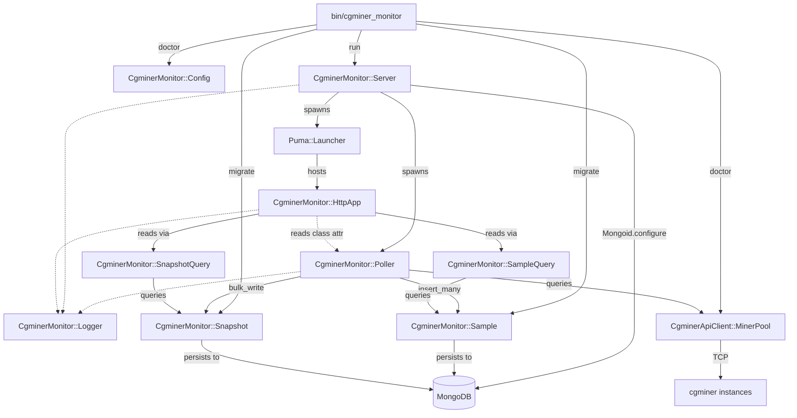

# Codebase Info

## What this is

`cgminer_monitor` is a standalone Ruby daemon (**not** a Rails engine anymore, as of the 1.0 rewrite in April 2026) that periodically polls [cgminer](https://github.com/ckolivas/cgminer) instances over their JSON API, stores device/pool/summary/stats data in MongoDB, and exposes a read-only HTTP API for querying historical and current miner state.

It ships as both a gem (so operators can `gem install cgminer_monitor` and get a `cgminer_monitor` executable) and a Docker image (multi-stage `Dockerfile` plus `docker-compose.yml`). It is **not** a library-first gem — nobody should be `require 'cgminer_monitor'`-ing it from their own code. It is invoked exclusively through its CLI.

At runtime the process has two threads:
- **Poller** — runs one iteration per `CGMINER_MONITOR_INTERVAL` seconds, fans out cgminer commands across every configured miner via `CgminerApiClient::MinerPool`, extracts numeric metrics, and writes time-series samples + latest-state snapshots to Mongo.
- **HTTP server** — an embedded Puma serving a Sinatra app on `CGMINER_MONITOR_HTTP_PORT` (default `9292`). Read-only; serves `/v2/*` API endpoints, Prometheus metrics, and Swagger UI.

## Stack

- **Language:** Ruby 3.2+ (gemspec `required_ruby_version`).
- **CI matrix:** Ruby 3.2/3.3/3.4 required × Mongo 6/7. Ruby 4.0 and `head` are best-effort (Mongoid 9 doesn't officially support them yet).
- **Storage:** MongoDB 5.0+. 5.0 is the minimum for time-series collections; 6.0 is what the GitHub Actions matrix tests against because it's the earliest Mongo version available in `services:` runners.
- **Runtime gem deps:** `cgminer_api_client ~> 0.3.0`, `mongoid ~> 9.0`, `sinatra >= 4.0`, `puma >= 6.0`, `rack-cors ~> 2.0`.
- **Dev deps:** `rspec >= 3.13`, `rack-test >= 2.1`, `rubocop >= 1.60` (+ `-rake`, `-rspec`), `rake >= 13.2`, `simplecov >= 0.22`.
- **Test framework:** RSpec. Unit specs at `spec/cgminer_monitor/**`, integration specs at `spec/integration/`, plus a top-level `spec/openapi_consistency_spec.rb` that CI uses to enforce route↔openapi.yml parity.
- **Lint:** RuboCop with `TargetRubyVersion: 3.2`. Default rake task runs spec + rubocop.
- **Coverage:** SimpleCov, filter `/spec/`; reports to `coverage/`.
- **Containerization:** Dockerfile (multi-stage, `ruby:3.4-slim` base) and `docker-compose.yml` (Mongo + cgminer_monitor + optional FakeCgminer for testing).

## Directory layout

```
cgminer_monitor/
├── bin/
│   └── cgminer_monitor              # CLI: run / migrate / doctor / version
├── lib/
│   ├── cgminer_monitor.rb           # Entry point: require graph only
│   └── cgminer_monitor/
│       ├── config.rb                # Data.define Config, from_env, validate!, current/reset! helpers
│       ├── errors.rb                # Error < StandardError, ConfigError, StorageError, PollError
│       ├── logger.rb                # Structured JSON/text logger (module singleton, thread-safe)
│       ├── sample.rb                # Mongoid time-series model (samples collection)
│       ├── sample_query.rb          # Read-side module: hashrate, temperature, availability series
│       ├── snapshot.rb              # Mongoid regular model (latest_snapshot collection)
│       ├── snapshot_query.rb        # Read-side: for_miner, miners, last_poll_at
│       ├── poller.rb                # Polling loop, sample extraction, bulk writes
│       ├── server.rb                # Orchestrator: Mongoid config, Poller thread, Puma thread, signal handling
│       ├── http_app.rb              # Sinatra app: /v2/* endpoints, Prometheus, /docs, /openapi.yml
│       ├── openapi.yml              # OpenAPI 3.1 spec (served at /openapi.yml, lint-checked in CI)
│       └── version.rb               # VERSION = "1.0.0"
├── spec/
│   ├── spec_helper.rb               # SimpleCov + require_relative support/**
│   ├── cgminer_monitor_spec.rb
│   ├── cgminer_monitor/             # Unit specs, one per lib/ file
│   ├── integration/
│   │   ├── cli_spec.rb              # Spawns the real bin/ via Open3
│   │   ├── full_pipeline_spec.rb    # FakeCgminer + Poller + Mongo + HttpApp end-to-end
│   │   └── healthz_spec.rb          # State transitions: starting → healthy → degraded
│   ├── openapi_consistency_spec.rb  # CI guard: routes vs openapi.yml
│   └── support/
│       ├── cgminer_fixtures.rb      # Canned cgminer JSON responses (shared with cgminer_api_client)
│       ├── fake_cgminer.rb          # In-process TCP cgminer server (shared with cgminer_api_client)
│       └── mongo_helper.rb          # Test Mongo config + per-spec db reset
├── config/
│   └── miners.yml.example           # Ships in the gem; operator copies to config/miners.yml
├── .github/workflows/ci.yml         # Lint, Test matrix, Integration, OpenAPI consistency jobs
├── Dockerfile                       # Multi-stage: builder (build-essential) → runtime (ruby:3.4-slim)
├── docker-compose.yml               # mongo + cgminer_monitor + optional fake_cgminer under "testing" profile
├── .rubocop.yml
├── .rspec                           # --color --warnings --require spec_helper (implicit)
├── .ruby-version                    # local dev pin
├── Rakefile                         # default: [spec, rubocop]
├── Gemfile
├── cgminer_monitor.gemspec
├── CHANGELOG.md                     # Keep-a-Changelog; 1.0.0 release notes
├── MIGRATION.md                     # 0.x → 1.0 migration guide for cgminer_manager consumers
├── README.md
└── LICENSE.txt                      # MIT
```

Files packaged in the gem (via the gemspec `spec.files` glob): `lib/**/*.rb`, `lib/**/*.yml` (the OpenAPI spec), `bin/*`, `README.md`, `LICENSE.txt`, `CHANGELOG.md`, `cgminer_monitor.gemspec`. Notably **not** packaged: `spec/`, `config/miners.yml.example` (deliberately — the docker-compose assumes the operator mounts their own), `docs/`, `.github/`, `Dockerfile`, `docker-compose.yml`, `MIGRATION.md`.

## Languages and tooling

| | |
|---|---|
| Primary language | Ruby |
| Other languages | None (the Dockerfile is the closest thing to non-Ruby config) |
| Build tool | `bundler` (gem), `rake` (default task), `docker` (container image) |
| Package format | RubyGem (`.gem`) + Docker image |
| Distribution | [RubyGems.org](https://rubygems.org/gems/cgminer_monitor) and Docker Hub / GHCR (if published) |

## High-level module graph



## Key facts worth knowing up front

1. **Two threads, one process.** Poller and Puma run concurrently in the same Ruby process. Shutdown coordinates both; see `architecture.md`.
2. **`Config` is immutable** (`Data.define`). No hot reload. Changing env vars requires a restart.
3. **Mongoid is configured programmatically** from `CGMINER_MONITOR_MONGO_URL` — there is no `config/mongoid.yml` in 1.0.
4. **`miners.yml` is loaded at boot** and frozen. Adding/removing miners requires a restart.
5. **`HttpApp` has class-level state** (`.poller`, `.started_at`, `.configured_miners_cache`) set by `Server` at boot. Tests must call `HttpApp.reset_configured_miners!` between examples.
6. **The samples collection is a MongoDB time-series collection** (Mongo 5.0+ feature) with an `expire_after` TTL matching `CGMINER_MONITOR_RETENTION_SECONDS`. `cgminer_monitor migrate` (or `Server#bootstrap_mongoid!`) does the `create_collection` call.
7. **No authentication on the HTTP API.** Designed for trusted networks. Put a reverse proxy in front of it if you're exposing it beyond that.
8. **`cgminer_api_client` is a hard runtime dependency.** The `Poller` bypasses `CgminerApiClient::MinerPool.new` (which hard-codes a `config/miners.yml` path relative to CWD) by allocating the pool and setting `.miners=` directly, so it can honor the configurable `CGMINER_MONITOR_MINERS_FILE`.

## Version and release posture

- Current release: **1.0.0** (2026-04-15). Ground-up rewrite; see `CHANGELOG.md` and `MIGRATION.md`.
- Semantic Versioning. The 1.0 release drew a line under 0.x's Rails-engine shape.
- `rubygems_mfa_required` set in gemspec metadata.
- `Gemfile.lock` is `.gitignore`d — this gem expects consumers to generate their own.
