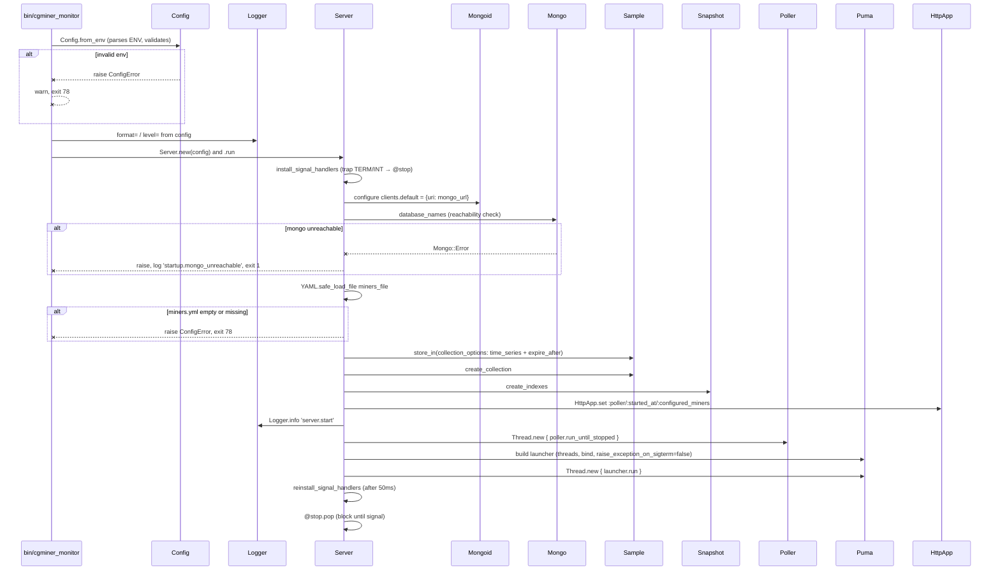
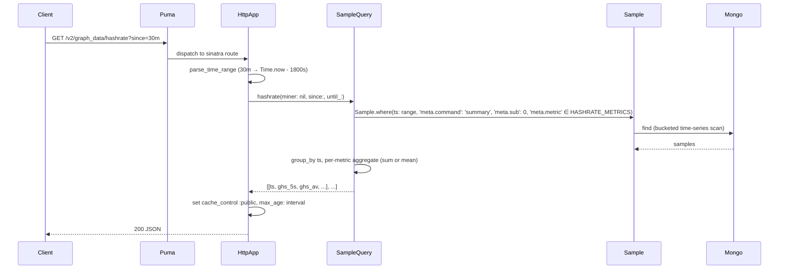
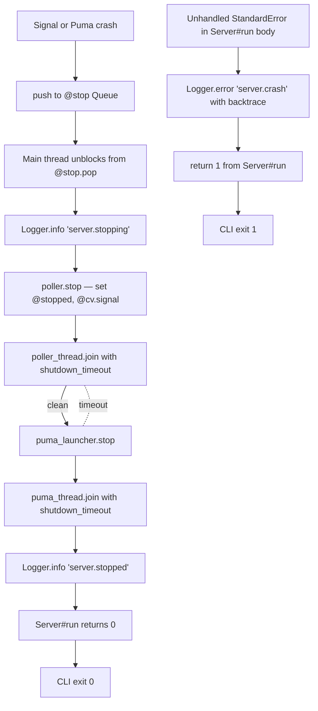
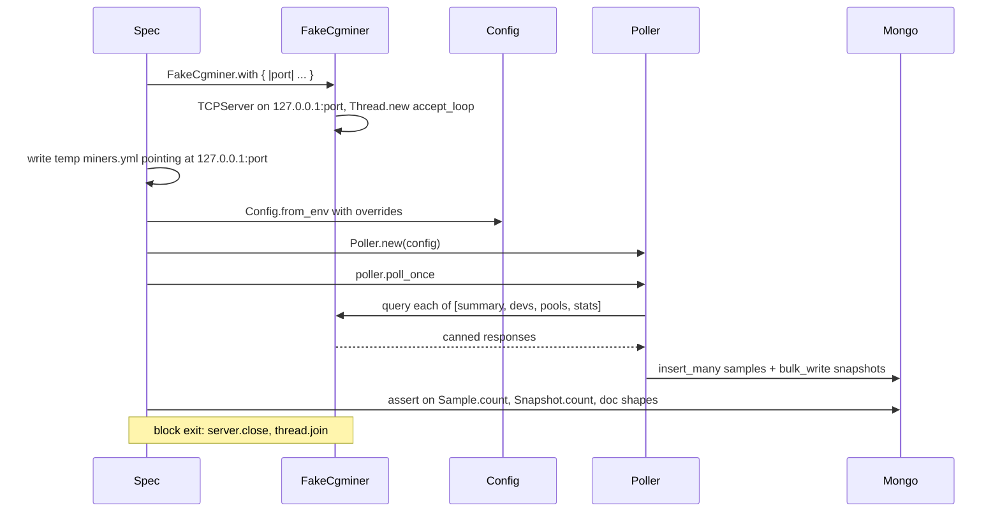

# Workflows

Four runtime flows cover essentially everything: startup, polling, HTTP request handling, and graceful shutdown. Plus three dev/test workflows: running the suite locally against a fake cgminer + real Mongo, the OpenAPI consistency check, and the Docker Compose dev stack.

## 1. Startup (`cgminer_monitor run`)



**Key observations:**
- `Config.from_env` is the single place env vars turn into a validated snapshot. Every subsequent reader sees the same immutable record.
- Two things can make startup fail: a `ConfigError` (exit 78) or anything else — mongo unreachable, miners_file issues — that bubbles out (exit 1).
- The signal-handler install → Puma start → reinstall sequence is load-bearing. See `architecture.md` for the gory details.
- `HttpApp` gets wired up **before** the Poller thread starts, so the very first request to `/healthz` after boot returns a sane response even if no poll has happened yet (`status: starting` when `mongo: true`, `last_poll_at: null`, and `uptime_s < startup_grace`).

## 2. Polling (`Poller#run_until_stopped`)

```mermaid
sequenceDiagram
    participant Loop as run_until_stopped
    participant Clock
    participant Poller as poll_once
    participant Pool as CgminerApiClient::MinerPool
    participant Miners as miner threads
    participant Cgminer
    participant Sample
    participant Snapshot
    participant Mongo
    participant Logger
    participant Sleep as interruptible_sleep

    loop until @stopped
        Loop->>Clock: started_at = CLOCK_MONOTONIC
        Loop->>Poller: poll_once

        loop each of [summary, devs, pools, stats]
            Poller->>Pool: pool.query(command)
            par one thread per miner
                Pool->>Miners: miner.query(command)
                Miners->>Cgminer: TCP JSON request
                Cgminer-->>Miners: response
                Miners-->>Pool: MinerResult.success or failure
            end
            Pool-->>Poller: PoolResult
        end

        loop each miner
            alt miner_result.ok? for this command
                Poller->>Poller: extract_samples (numeric fields only)
                Poller->>Poller: build snapshot upsert {ok: true, response:}
            else
                Poller->>Poller: build snapshot upsert {ok: false, error:}
                Poller->>Logger: 'poll.miner_failed'
            end
            Poller->>Poller: append synthetic 'poll' samples (ok, duration_ms)
        end

        Poller->>Sample: collection.insert_many(all_samples)
        Poller->>Snapshot: collection.bulk_write(ops, ordered: false)
        Poller->>Logger: 'poll.complete' with counts

        Loop->>Clock: elapsed = CLOCK_MONOTONIC - started_at
        Loop->>Sleep: remaining = interval - elapsed
        alt remaining > 0
            Sleep->>Sleep: @cv.wait(@mutex, remaining) unless @stopped
        end
    end
```

**Key observations:**
- `CLOCK_MONOTONIC` is used for the interval accounting so clock-skew / NTP steps don't make the loop run fast or stall.
- One cgminer command at a time per pool query, but within that query every miner is hit in parallel (cgminer_api_client's `MinerPool` spawns a thread per miner).
- Errors from cgminer (per-miner) land as `MinerResult.failure` inside the `PoolResult`. `Poller#process_failure` turns those into failed `Snapshot` docs rather than letting them halt the poll.
- `Mongo::Error` and generic `StandardError` at the top of `poll_once` are caught, counted, and logged. They don't crash the thread. The supervisor sees a process that's still running but whose `/metrics` `cgminer_monitor_polls_total{result="failed"}` is climbing.
- `@cv.wait(@mutex, remaining)` is how `Poller#stop` can wake the sleep early — it signals the same condvar. See `architecture.md`.

## 3. HTTP request handling

A sample read-path flow, graph data:



The `/healthz` flow differs in that it reads from `SnapshotQuery` (current state), checks Mongo reachability inline, consults `HttpApp.started_at`, and computes the `starting/healthy/degraded` state from `Config` thresholds.

`/metrics` is an exception to the "read via query modules" pattern — it queries `Snapshot` directly for Prometheus gauges and reads the live `Poller` counters from `HttpApp.poller` for poll-total counters. Sinatra's `content_type` is overridden to `text/plain; version=0.0.4; charset=utf-8` for Prometheus compatibility.

## 4. Graceful shutdown

Triggered by SIGTERM, SIGINT, or a Puma-thread crash pushing `'puma_crash'` to the stop queue.



**Timeouts are per-thread.** If the poller thread is mid-`insert_many` and can't finish within `CGMINER_MONITOR_SHUTDOWN_TIMEOUT` (default 10s), `join` returns without it. Same for Puma. Worst case, the supervisor sends SIGKILL a bit later and Mongo's connection drops mid-operation; since writes are bulk insert/upsert, this is generally safe.

**Puma thread crashes** (exceptions inside `launcher.run`) are caught by `Thread.new do ... rescue Exception`, logged as `puma.crash`, and pushed to `@stop` so the main thread goes through the normal shutdown path.

## 5. Local dev: running tests

```sh
# 1. Start Mongo for tests (keep it running)
docker run -d --name cgminer-mongo-test -p 27017:27017 mongo:7

# 2. Install gems
bundle install

# 3. Run tests + rubocop
bundle exec rake

# Or piecemeal:
bundle exec rspec                                     # all specs
bundle exec rspec spec/cgminer_monitor                # unit only
bundle exec rspec spec/integration                    # integration only (needs Mongo + FakeCgminer)
bundle exec rspec spec/openapi_consistency_spec.rb    # route ↔ openapi.yml parity
bundle exec rspec path/to/spec.rb:123                 # single example by line
bundle exec rubocop                                   # lint only
bundle exec rubocop -A                                # auto-correct
```

Coverage is enabled automatically (SimpleCov in `spec_helper.rb`). Reports land in `coverage/`, which is `.gitignore`d.

## 6. Integration test: FakeCgminer + real Mongo

`spec/integration/full_pipeline_spec.rb` exercises the full write path end-to-end:



`spec/integration/cli_spec.rb` spawns the real `bin/cgminer_monitor` binary via `Open3.capture3` and asserts on exit codes and stream contents for `migrate`, `doctor`, `version`, and the deprecated shims. It does **not** currently run the full `run` command end-to-end — that would require orchestrating signal delivery from the spec process, which is fiddly.

`spec/integration/healthz_spec.rb` verifies the `starting → healthy → degraded` state transitions of `/healthz` under controlled time / config conditions.

## 7. OpenAPI consistency check

`spec/openapi_consistency_spec.rb` walks `HttpApp`'s Sinatra routes (`HttpApp.routes`) and cross-checks against `lib/cgminer_monitor/openapi.yml`:

- Every route registered on `HttpApp` should have a corresponding `paths:` entry in `openapi.yml`.
- Every path in `openapi.yml` should correspond to a registered route.

CI runs this as its own job (`openapi-check`). Drift fails the build. Adding or removing routes requires updating `openapi.yml` in the same commit.

## 8. Docker Compose dev stack

```sh
# Just Mongo (for local spec runs)
docker-compose up -d mongo

# Full stack (app + mongo)
cp config/miners.yml.example config/miners.yml
docker-compose up

# With a FakeCgminer for end-to-end demos without real hardware
docker-compose --profile testing up
```

The `fake_cgminer` service is gated under the `testing` profile so it doesn't come up by default. It mounts `spec/support/` into a raw `ruby:3.4-slim` image (not the app Dockerfile, which excludes `spec/`) and runs `FakeCgminer.with(port: 4028) { |p| ...; sleep }` as a foreground process. Operators point their `miners.yml` at `fake_cgminer:4028` inside the Compose network for wire-level sandboxing.

## 9. Release

Not automated. On a clean `master`:

```sh
bundle exec rake                                 # must pass
# bump VERSION in lib/cgminer_monitor/version.rb
# update CHANGELOG.md
git commit -am "Release vX.Y.Z"
gem build cgminer_monitor.gemspec                # produces cgminer_monitor-X.Y.Z.gem
gem push cgminer_monitor-X.Y.Z.gem               # requires 2FA (rubygems_mfa_required)
git tag vX.Y.Z
git push origin master vX.Y.Z
```

Container images (Docker Hub / GHCR) aren't currently pushed by CI; if that happens later, it'd be a separate workflow triggered on tag push.
